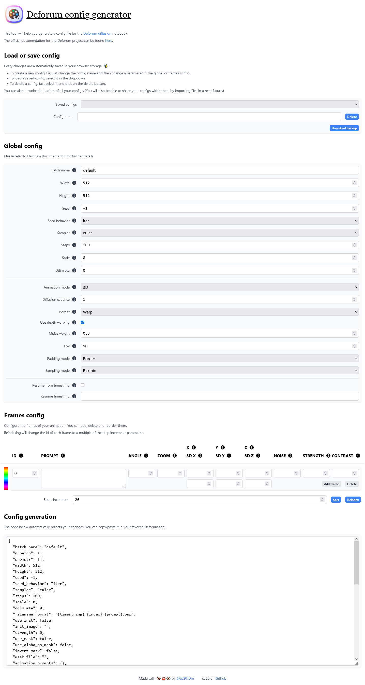

# 🎨 Deforum config generator

This tool will help you generate a config file for the Deforum diffusion notebook.

It is a client only web app, so you can use it without any server. It will save your config file in your browser's local storage.

👉 [web app link](https://e29hdm.github.io/inputdeforum/)

## Screenshot

